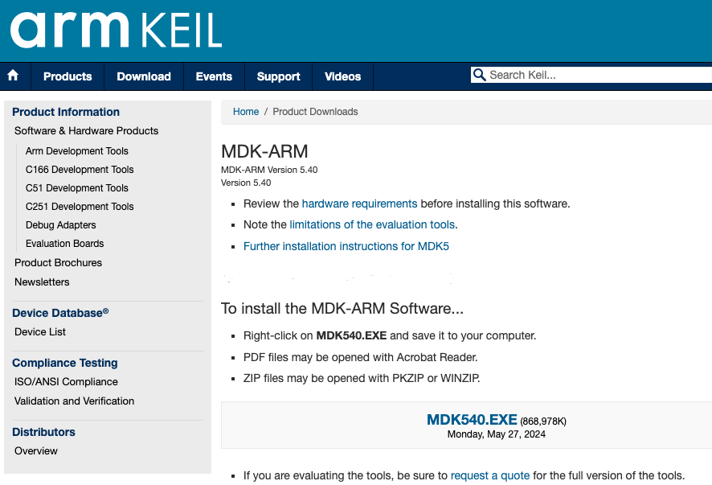

# **Keil 5 Installation**

Example code has been tested **Keil uVision IDE version 5.40**, and we are writing software in **C99**. Any version of **5.xx** should be ok. These programs only run on **Windows 10 or 11**.

There is a way to install software on older **Macintosh** computers so Windows and its applications will run on the Macintosh, see running **Keil and TExaS on a Macintosh**. However, there is no solution to running Keil on the new Macintosh computers with the **M1/M2/M3 processor**, because there are no OS drivers for the **Stellaris ICDI debugger**. Macintosh users with the **M1 processor** can write software on **CCS**. We are sorry, but there are no solutions for **Linux**. The **Keil application** does not require a serial number or license key. Installing both **Keil uVision 4.74** and **Keil uVision 5.40** on the same computer is possible.

## **Step 1)** How to install **Keil uVision** for the **ARM, MDK-Lite (32KB) Edition**.

Go to **[https://www.keil.com/demo/eval/arm.htm](https://www.keil.com/demo/eval/arm.htm)**. Enter your contact information with a valid address, phone, and email.

Set your Company to the **Macau University of Science and Technology**. Set your devices to the **TI and Cortex-M4**. Fill in all fields of this form. It should not cost any money, and you can select or not select whether you want email from **ARM**. **ARM** does provide support for **Keil** via its **ARM University**.

So if you have any Keil-specific questions you could register and post them at **[http://www.arm.com/university/](http://www.arm.com/university/)**

## **Step 2)** Right-click on **MDK540.EXE** and download this **8xx M** file to your computer.

## **Step 3)** Execute the **MDK540.EXE** file, installing the application in some place that is easy to find, like **C:\Keil** or **D:\Keil**.

You will need to find the **Keil directory** because the **TExaS example files** will be loaded into this same directory. After you have run the **MDK538A.EXE installer**, you will not need this file. However, you can use this file to install Keil on additional computers.

## 添加图片的代码示例：

```html


